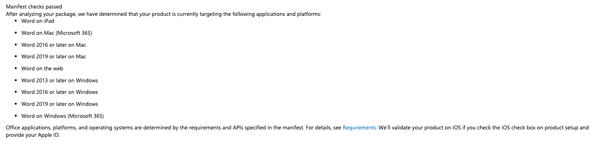

## Lingo Client
[Project Docs](https://docs.google.com/document/d/1Ackz0l2ix9Cd8XQw5h_hh0SCI3T0raT1b7vVhfERrVU)

### Prod;
- [Client Service](https://lug-spell.github.io/client/taskpane.html)

### Minimum Supported Versions
- Office for Windows: 2013
- Office for Mac: 2016
- Word for Web: Since September 2016

### To run;
- (If on mac) run `npm run dev-server`
- Run `npm run dev`

### Helpful links;
- Access console logs: https://docs.microsoft.com/en-us/office/dev/add-ins/testing/debug-office-add-ins-on-ipad-and-mac
- 

### Pending;
- move words to infinite scroll
- highlight word when clicked
- ui freezing up while fetching words
- improve auto refresh, performance compromise- right now, we have to choose one- auto refresh/ view more words

### Nice to have;
- Use indexed db fixes(investigate https://www.npmjs.com/package/react-indexed-db-hooks)
- Ignore word for this doc

### Architecture

### Gotchas
- [Build size](https://github.com/OfficeDev/generator-office/issues/427#issuecomment-651861161)- Make sure you use selective imports to avoid pulling in alot of unnecessary code in the build. Not doing this leads to a build size of >5mb == terrible

### Bootstrapped by
This repository contains the source code used by the [Yo Office generator](https://github.com/OfficeDev/generator-office) when you create a new Office Add-in that appears in the task pane. You can also use this repository as a sample to base your own project from if you choose not to use the generator. 

### Debugging
Open a browser dev console to look at logs by:
- Mac: https://learn.microsoft.com/en-us/office/dev/add-ins/testing/debug-office-add-ins-on-ipad-and-mac
- 

### Relevant Links
- [Tutorial](https://docs.microsoft.com/en-us/office/dev/add-ins/tutorials/word-tutorial)
- [Use a browser's developer tools](https://docs.microsoft.com/office/dev/add-ins/testing/debug-add-ins-in-office-online)
- [Attach a debugger from the task pane](https://docs.microsoft.com/office/dev/add-ins/testing/attach-debugger-from-task-pane)
- [Use F12 developer tools on Windows 10](https://docs.microsoft.com/office/dev/add-ins/testing/debug-add-ins-using-f12-developer-tools-on-windows-10)
